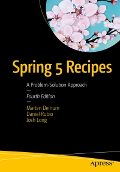

# Apress Source Code

This repository accompanies [*Spring 5 Recipes*](http://www.apress.com/9781484227893) by Marten Deinum, Daniel Rubio, and Josh Long (Apress, 2017).

[comment]: #cover

Download the files as a zip using the green button, or clone the repository to your machine using Git.

## Releases

Release v1.0 corresponds to the code in the published book, without corrections or updates.

## Contributions

See the file Contributing.md for more information on how you can contribute to this repository.

----

스프링 5 레시피 스프링 애플리케이션 개발에 유용한 161가지 문제 해결 기법 (1,2권 분책 구성) [ 개정4판 ]
마틴 데이넘, 다니엘 루비오, 조시 롱 저/이일웅 역 | 한빛미디어 | 2018년 08월 14일 | 원서 : Spring 5 Recipes: A Problem-Solution Approach

## 책소개
스프링 현업 개발자를 위한 스프링 5 실무 바이블(전2권)

이 책은 스프링 5에 새로 탑재된 기능 및 다양한 구성 옵션 등 업데이트된 프레임워크 전반을 실무에 유용한 해법을 제시하는 형식으로 다룹니다. IoC 컨테이너 같은 스프링 기초부터 스프링 AOP/AspectJ, 자바 EE 연계 및 원격 기술, 스프링 인티그레이션, 스프링 배치, 스프링 메시징, 트랜잭션, 스프링 MVC를 비롯하여 그레일즈 프레임워크, REST/웹 서비스 관련 실전 레시피도 제공합니다.

161가지 레시피는 과제/해결책/풀이로 구성되어 있어 현업에 유용합니다. 현업에서 풀어야 할 문제를 과제로 제시하고, 해결책으로 전반적인 방법을 확인합니다. 끝으로 실무에 당장 활용할 수 있는 예제를 중심으로 과제를 해결합니다. 지금 바로 엔터프라이즈 자바 애플리케이션을 구축하는 데 유용한 최신 스프링 기능을 집중 조명하는 예제를 내려받아 프로젝트에 마음껏 활용하세요. 엄청나게 많은 시간을 절약해줄 겁니다!

* 독자의 편의를 고려해 분책할 수 있게 제본했습니다. 1권은 9장까지, 2권은 10장부터 끝까지 담고 있습니다.

## 목차
## CHAPTER 1 스프링 개발 툴
- [레시피 1-1] STS로 스프링 애플리케이션 빌드하기
- [레시피 1-2] 인텔리제이로 스프링 애플리케이션 빌드하기
- [레시피 1-3] 메이븐 CLI로 스프링 애플리케이션 빌드하기
- [레시피 1-4] 메이븐 래퍼로 스프링 애플리케이션 빌드하기
- [레시피 1-5] 그레이들 CLI로 스프링 애플리케이션 빌드하기
- [레시피 1-6] 그레이들 래퍼로 스프링 애플리케이션 빌드하기

## CHAPTER 2 스프링 코어  
- [레시피 2-1] 자바로 POJO 구성하기
- [레시피 2-2] 생성자 호출해서 POJO 생성하기
- [레시피 2-3] POJO 레퍼런스와 자동 연결을 이용해 다른 POJO와 상호 작용하기
- [레시피 2-4] @Resource와 @Inject를 붙여 POJO 자동 연결하기
- [레시피 2-5] @Scope를 붙여 POJO 스코프 지정하기
- [레시피 2-6] 외부 리소스(텍스트, XML, 프로퍼티, 이미지 파일)의 데이터 사용하기
- [레시피 2-7] 프로퍼티 파일에서 로케일마다 다른 다국어 메시지를 해석하기
- [레시피 2-8] 애너테이션을 이용해 POJO 초기화/폐기 커스터마이징하기
- [레시피 2-9] 후처리기를 만들어 POJO 검증/수정하기
- [레시피 2-10] 팩토리(정적 메서드, 인스턴스 메서드, 스프링 FactoryBean)로 POJO 생성하기 96
- [레시피 2-11] 스프링 환경 및 프로파일마다 다른 POJO 로드하기
- [레시피 2-12] POJO에게 IoC 컨테이너 리소스 알려주기
- [레시피 2-13] 애너테이션을 활용해 애스펙트 지향 프로그래밍하기
- [레시피 2-14] 조인포인트 정보 가져오기
- [레시피 2-15] @Order로 애스펙트 우선순위 설정하기
- [레시피 2-16] 애스펙트 포인트컷 재사용하기
- [레시피 2-17] AspectJ 포인트컷 표현식 작성하기
- [레시피 2-18] 인트로덕션을 이용해 POJO에 기능 더하기
- [레시피 2-19] AOP를 이용해 POJO에 상태 추가하기
- [레시피 2-20] AspectJ 애스펙트를 로드 타임 위빙하기
- [레시피 2-21] 스프링에서 AspectJ 애스펙트 구성하기
- [레시피 2-22] AOP를 이용해 POJO를 도메인 객체에 주입하기
- [레시피 2-23] 스프링 TaskExecutor로 동시성 적용하기
- [레시피 2-24] POJO끼리 애플리케이션 이벤트 주고받기

## CHAPTER 3 스프링 MVC
- [레시피 3-1] 간단한 스프링 MVC 웹 애플리케이션 개발하기
- [레시피 3-2] @RequestMapping에서 요청 매핑하기
- [레시피 3-3] 핸들러 인터셉터로 요청 가로채기
- [레시피 3-4] 유저 로케일 해석하기
- [레시피 3-5] 로케일별 텍스트 메시지 외부화하기
- [레시피 3-6] 이름으로 뷰 해석하기
- [레시피 3-7] 뷰와 콘텐트 협상 활용하기
- [레시피 3-8] 뷰에 예외 매핑하기
- [레시피 3-9] 컨트롤러에서 폼 처리하기
- [레시피 3-10] 마법사 폼 컨트롤러로 다중 페이지 폼 처리하기
- [레시피 3-11] 표준 애너테이션(JSR-303)으로 빈 검증하기
- [레시피 3-12] 엑셀 및 PDF 뷰 생성하기

## CHAPTER 4 스프링 REST
- [레시피 4-1] REST 서비스로 XML 발행하기
- [레시피 4-2] REST 서비스로 JSON 발행하기
- [레시피 4-3] 스프링으로 REST 서비스 액세스하기
- [레시피 4-4] RSS/아톰 피드 발행하기

## CHAPTER 5 스프링 MVC : 비동기 처리
- [레시피 5-1] 트롤러에서 TaskExecutor로 요청을 비동기 처리하기
- [레시피 5-2] 응답 출력기
- [레시피 5-3] 비동기 인터셉터
- [레시피 5-4] 웹소켓
- [레시피 5-5] 스프링 웹플럭스로 리액티브 애플리케이션 개발하기
- [레시피 5-6] 리액티브 컨트롤러로 폼 처리하기
- [레시피 5-7] 리액티브 REST 서비스로 JSON 발행/소비하기
- [레시피 5-8] 비동기 웹 클라이언트
- [레시피 5-9] 리액티브 핸들러 함수 작성하기

## CHAPTER 6 스프링 소셜
- [레시피 6-1] 스프링 소셜 구성하기
- [레시피 6-2] 트위터 접속하기
- [레시피 6-3] 페이스북 접속하기
- [레시피 6-4] 서비스 공급자 접속 상태 보여주기
- [레시피 6-5] 트위터 API 활용하기
- [레시피 6-6] UsersConnectionRepository로 저장하기
- [레시피 6-7] 스프링 소셜과 스프링 시큐리티 연계하기

## CHAPTER 7 스프링 시큐리티
- [레시피 7-1] URL 접근 보안하기
- [레시피 7-2] 웹 애플리케이션 로그인하기
- [레시피 7-3] 유저 인증하기
- [레시피 7-4] 접근 통제 결정하기
- [레시피 7-5] 메서드 호출 보안하기
- [레시피 7-6] 뷰에서 보안 처리하기
- [레시피 7-7] 도메인 객체 보안 처리하기
- [레시피 7-8] 웹플럭스 애플리케이션에 보안 기능 추가하기

## CHAPTER 8 스프링 모바일
- [레시피 8-1] 스프링 모바일 없이 기기 감지하기
- [레시피 8-2] 스프링 모바일을 이용해 기기 감지하기
- [레시피 8-3] 사이트 기본 설정
- [레시피 8-4] 기기 정보에 따라 뷰 렌더링하기
- [레시피 8-5] 사이트 스위칭 구현하기

##CHAPTER 9 데이터 액세스
- JDBC를 직접 사용할 경우의 문제점
- 애플리케이션 DB 구성하기
- DAO 디자인 패턴
- JDBC로 DAO 구현하기
- 스프링 데이터 소스 구성하기
- DAO 실행하기
- [레시피 9-1] JDBC 템플릿으로 DB 수정하기
- [레시피 9-2] JDBC 템플릿으로 DB 조회하기
- [레시피 9-3] JDBC 템플릿을 간단하게 생성하기
- [레시피 9-4] JDBC 템플릿에서 기명 매개변수 사용하기
- [레시피 9-5] 스프링 JDBC 프레임워크에서 예외 처리하기
- [레시피 9-6] ORM 프레임워크 활용하기
- [레시피 9-7] 스프링에서 ORM 리소스 팩토리 구성하기
- [레시피 9-8] 하이버네이트 컨텍스트 세션으로 객체 저장하기
- [레시피 9-9] JPA 컨텍스트를 주입하여 객체 저장하기
- [레시피 9-10] 스프링 데이터 JPA로 JPA 코드 간소화하기

## CHAPTER 10 스프링 트랜잭션 관리
- [레시피 10-1] 트랜잭션 관리의 중요성
- [레시피 10-2] 트랜잭션 관리자 구현체 선정하기
- [레시피 10-3] 트랜잭션 관리자 API를 이용해 프로그램 방식으로 트랜잭션 관리하기
- [레시피 10-4] 트랜잭션 템플릿을 이용해 프로그램 방식으로 트랜잭션 관리하기
- [레시피 10-5] @ Transactional을 붙여 선언적으로 트랜잭션 관리하기
- [레시피 10-6] 트랜잭션 전달 속성 설정하기
- [레시피 10-7] 트랜잭션 격리 속성 설정하기
- [레시피 10-8] 트랜잭션 롤백 속성 설정하기
- [레시피 10-9] 트랜잭션 타임아웃, 읽기 전용 속성 설정하기
- [레시피 10-10] 로드타임 위빙을 이용해 트랜잭션 관리하기

## CHAPTER 11 스프링 배치
- 런타임 메타데이터 모델
- [레시피 11-1] 스프링 배치 기초 공사하기
- [레시피 11-2] 데이터 읽기/쓰기
- [레시피 11-3] 커스텀 ItemWriter/ItemReader 작성하기
- [레시피 11-4] 출력하기 전에 입력 데이터 처리하기
- [레시피 11-5] 트랜잭션을 걸어 편하게 삽시다
- [레시피 11-6] 재시도
- [레시피 11-7] 스텝 실행 제어하기
- [레시피 11-8] 잡 실행하기
- [레시피 11-9] 잡을 매개변수화하기

## CHAPTER 12 스프링 NoSQL
- [레시피 12-1] 몽고디비
- [레시피 12-2] 레디스
- [레시피 12-3] Neo4j
- [레시피 12-4] 카우치베이스

## CHAPTER 13 스프링 자바 엔터프라이즈 서비스와 원격 기술
- [레시피 13-1] 스프링 빈을 JMX MBean으로 등록하기
- [레시피 13-2] JMX 알림 주고받기
- [레시피 13-3] 스프링에서 원격 JMX MBean 액세스하기
- [레시피 13-4] 스프링에서 이메일 보내기
- [레시피 13-5] 스프링 쿼츠로 작업 스케줄링하기
- [레시피 13-6] 스프링으로 작업 스케줄링하기
- [레시피 13-7] RMI로 서비스 표출/호출하기
- [레시피 13-8] HTTP로 서비스 표출/호출하기
- [레시피 13-9] JAX-WS로 SOAP 웹 서비스 표출/호출하기
- [레시피 13-10] 규약우선 SOAP 웹 서비스
- [레시피 13-11] 스프링 웹 서비스로 SOAP 웹 서비스 표출/호출하기
- [레시피 13-12] 스프링 웹 서비스와 XML 마샬링을 이용해 SOAP 웹 서비스 개발하기

## CHAPTER 14 스프링 메시징
- [레시피 14-1] 스프링에서 JMS 메시지 주고받기
- [레시피 14-2] JMS 메시지 변환하기
- [레시피 14-3] JMS 트랜잭션 관리하기
- [레시피 14-4] 스프링에서 메시지 주도 POJO 생성하기
- [레시피 14-5] JMS 커넥션 캐싱/풀링하기
- [레시피 14-6] 스프링에서 AMQP 메시지 주고받기
- [레시피 14-7] 스프링 카프카로 메시지 주고받기

## CHAPTER 15 스프링 인티그레이션
- [레시피 15-1] 서로 다른 두 시스템 연계하기
- [레시피 15-2] JMS를 이용해 두 시스템 연계하기
- [레시피 15-3] 스프링 인티그레이션 메시지에서 컨텍스트 정보 얻기
- [레시피 15-4] 파일시스템을 사용해 시스템 연계하기
- [레시피 15-5] 메시지 형변환하기
- [레시피 15-6] 스프링 인티그레이션을 이용해 에러 처리하기
- [레시피 15-7] 스필리터와 애그리게이터로 연계 분기 처리하기
[레시피 15-8] 라우터를 이용해 조건부 라우팅하기
[레시피 15-9] 스프링 배치를 응용해 이벤트 스테이징하기
[레시피 15-10] 게이트웨이 활용하기

## CHAPTER 16 스프링 테스트
- [레시피 16-1] JUnit과 TestNG로 단위 테스트 작성하기
- [레시피 16-2] 단위/통합 테스트 작성하기
- [레시피 16-3] 스프링 MVC 컨트롤러에 대한 단위 테스트 작성하기
- [레시피 16-4] 통합 테스트 시 애플리케이션 컨텍스트 관리하기
- [레시피 16-5] 통합 테스트에 테스트 픽스처 주입하기
- [레시피 16-6] 통합 테스트에서 트랜잭션 관리하기
- [레시피 16-7] 통합 테스트에서 DB 액세스하기
- [레시피 16-8] 스프링 공통 테스트 애너테이션 활용하기
- [레시피 16-9] 스프링 MVC 컨트롤러에 대한 통합 테스트 작성하기
- [레시피 16-10] REST 클라이언트에 대한 통합 테스트 작성하기

## CHAPTER 17 그레일즈
- [레시피 17-1] 그레일즈 설치하기
- [레시피 17-2] 그레일즈 애플리케이션 만들기
- [레시피 17-3] 그레일즈 플러그인
- [레시피 17-4] 그레일즈의 개발, 테스트, 운영 환경
- [레시피 17-5] 애플리케이션 도메인 클래스 작성하기
- [레시피 17-6] 애플리케이션 도메인 클래스에 대한 CRUD 컨트롤러 및 뷰 작성하기
- [레시피 17-7] 다국어(I18n) 메시지 프로퍼티 구현하기
- [레시피 17-8] 영구 저장소 바꾸기
- [레시피 17-9] 로그 출력 커스터마이징하기
- [레시피 17-10] 단위/통합 테스트 실행하기
- [레시피 17-11] 커스텀 레이아웃 및 템플릿
- [레시피 17-12] GORM 쿼리
- [레시피 17-13] 커스텀 태그 생성하기
- [레시피 17-14] 보안 기능 추가하기

- 부록 A 클라우드에 배포하기
- 부록 B 캐싱
- 부록 C 예제 소스 실습 안내

